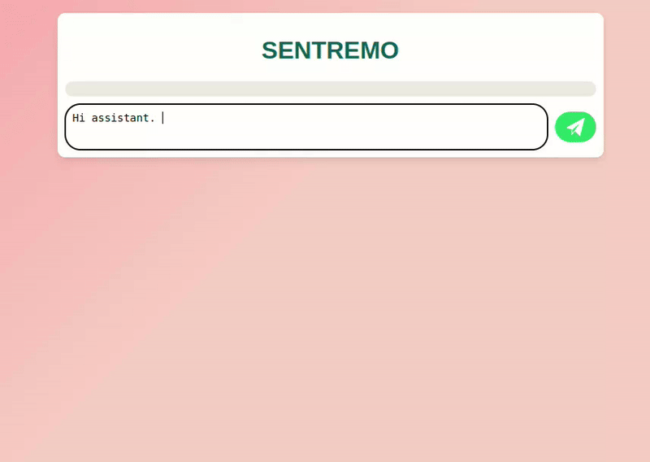

## SENTREMO chatbot (Flask)

Welcome to the **Chatbot Development** repository using Flask! 
This project aims to build an intelligent chatbot using state-of-the-art natural language processing (NLP) techniques. The chatbot can interact with user and attach emoji along with the user input to specify 'emotion'.

